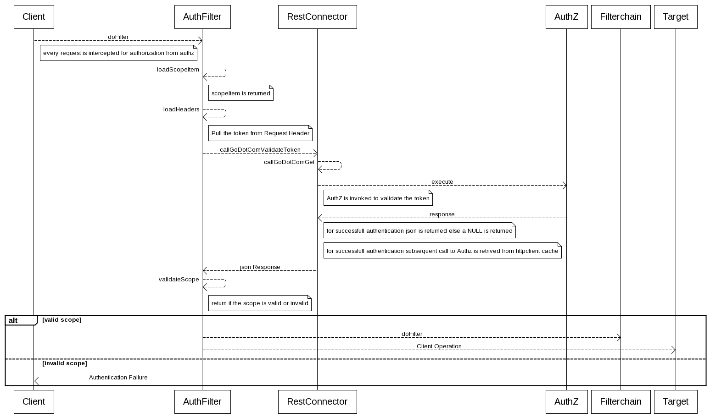

#  <u>WDPR Auth Filter User's Guide</u>

- [WDPR Auth Filter Quick Start Guide](#wdpr-Auth Filter-quick-start-guide)
- [How Auth Filter works](#how-auth-filter-works)
- [How to use demo application using auth filter](#how-to-use-demo-application-using-auth-filter)

# WDPR Auth Filter Quick Start Guide

Using the Authz Filters requires the below steps:

1.) Add the below dependency in the web project pom.xml file so as to add the filter code in the project dependency.
	
	       <dependency>
			<groupId>com.wdpr.ee</groupId>
			<artifactId>wdpr-authz</artifactId>
			<version>2.0.0</version>
			<exclusions>
                <!-- Old version 4.3 -->
			    <exclusion>
			        <artifactId>httpclient</artifactId>
			        <groupId>org.apache.httpcomponents</groupId>
			    </exclusion>
			</exclusions>
		</dependency> 

2.) Add the below filter entry in project web.xml

	<filter>
		<filter-name>HttpServletFilter</filter-name>
		<filter-class>com.wdpr.ee.loggingapi.filter.HttpLoggingFilter</filter-class>
	</filter>
	<filter-mapping>
		<filter-name>HttpServletFilter</filter-name>
		<url-pattern>/*</url-pattern>
	</filter-mapping>
	<filter>
		<filter-name>OAuthFilter</filter-name>
		<filter-class>com.wdpr.ee.authz.AuthFilter</filter-class>
	</filter>
	<filter-mapping>
		<filter-name>OAuthFilter</filter-name>
		<url-pattern>/*</url-pattern>
	</filter-mapping>

3.) Add the below (.properties,.json) file in web project class path same can be retrived from the git Location(https://github.disney.com/WDPR-RA-UI/Security-Filter/tree/shanghai/DemoApplication/src/main/resources)

	* scope.json
	* WdprLogAppender.properties
	* auth-config.properties
	
	
# How Auth Filter works
	
	
The following diagram shows the flow of execution for the auth filter api.

# How to use demo application using auth filter

1.) Open DHC Apps in Google Chrome.

2.) Add the URL localhost:8080/DemoApplication/ in Request text in DHC and chose the method as GET.

3.) Add the Headers "access_token" and value as the new valid Token values.Hit the Send button.

4.) in case of valid entry the response status will be return as 200  for invalid toke or not matching scope the response status will be 401.

5.) for the first time the request will be going to the Authz to do the validation for any subsequent hits the value will be pulled from HttpCacheContext.
